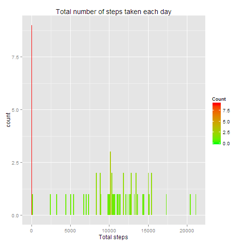
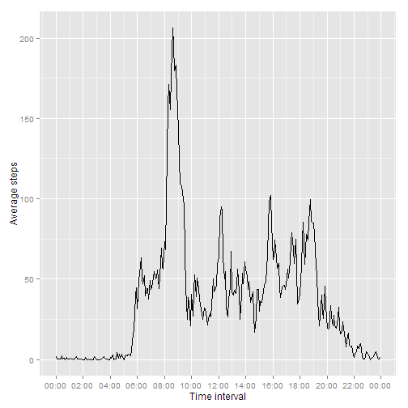
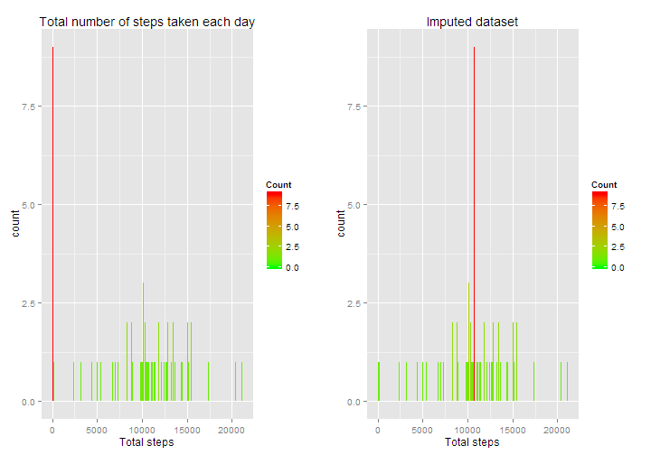
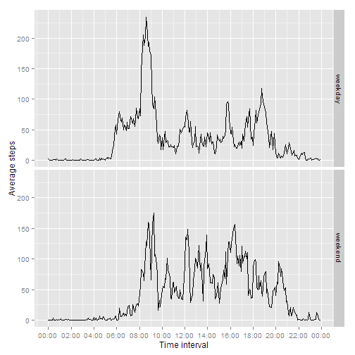

## Loading and preprocessing the data   

```r
setwd("Z:/PGM")
#setwd("C:/Temp")
Sys.setlocale("LC_TIME", "English")

act <- read.csv("activity.csv", header = 1, na.strings = "NA")
sum(!is.na(act$steps))
act$date<-as.Date(act$date, "%Y-%m-%d")
list<-unique(act$interval)
list<-unique(act$date)
summary(act)
suppressPackageStartupMessages(library(dplyr))
library(ggplot2)
library(scales)
```
  
  
## 1. What is mean total number of steps taken per day?  

```r
steps.by.day <- group_by(act, date) %>%
    summarise(total = sum(steps, na.rm=TRUE))

head(steps.by.day,5)
```

```
## Source: local data frame [5 x 2]
## 
##         date total
## 1 2012-10-01     0
## 2 2012-10-02   126
## 3 2012-10-03 11352
## 4 2012-10-04 12116
## 5 2012-10-05 13294
```
### 1-1. Make a histogram of the total number of steps taken each day  

```r
figure1<-ggplot(steps.by.day, aes(x=total)) +
    geom_histogram(aes(fill=..count..), binwidth=100) + 
    labs(x="Total steps") + ggtitle("Total number of steps taken each day") +
    scale_fill_gradient("Count", low = "green", high = "red")

print(figure1)
```

 

### 1-2. Calculate and report the mean and median total number of steps taken per day   

```r
summary(steps.by.day$total)
step.mean<-format(mean(steps.by.day$total), digits = 7)
step.median<-format(median(steps.by.day$total), digits=7)
```

Ans. The mean total number of steps taken per day is **9354.23**, and the median total number of steps taken per day is **10395**.  


## 2. What is the average daily activity pattern?  
### 2-1. Make a time series plot (i.e. type = "l") of the 5-minute interval (x-axis) and the average number of steps taken, averaged across all days (y-axis)  

```r
require (dplyr)
require (ggplot2)

steps.by.interval <- group_by(act, interval) %>%
    summarise(mean.step = mean(steps, na.rm=TRUE))

# Let 10 become 0010 by fomatC, then 00 for hour and 10 for minute
# Alternative, four.character <- sprintf("%04d", variable)

steps.by.interval$hr<- substr(
    formatC(steps.by.interval$interval, width = 4, format = "d", flag = "0")
                ,1,2)
steps.by.interval$min<-substr(
    formatC(steps.by.interval$interval, width = 4, format = "d", flag = "0")
                ,3,4)
steps.by.interval$time<-  with(steps.by.interval, paste(hr, min))
#unique(steps.by.interval$mean.step)    

steps.by.interval$time<-
    as.POSIXct(strptime(steps.by.interval$time,  "%H %M"))
```


```r
figure2<-ggplot(steps.by.interval, aes(time, mean.step)) + geom_line() +
    scale_x_datetime( 
    breaks = date_breaks("2 hour"), 
    labels = date_format("%H:%M")   )  + 
    labs(x="Time interval", y="Average steps")

print(figure2)
```

 


### 2-2. Which 5-minute interval, on average across all the days in the dataset, contains the maximum number of steps?  

```r
steps.by.interval<- arrange (steps.by.interval, -mean.step )
top.interval<-steps.by.interval[1,1]
top.interval.steps<-steps.by.interval[2,1]
```
Ans. The interval, **835**, contains the maximum number of **840** steps.


## 3. Imputing missing values  
Note that there are a number of days/intervals where there are missing values (coded as NA). The presence of missing days may introduce bias into some calculations or summaries of the data.  

### 3-1. Calculate and report the total number of missing values in the dataset (i.e. the total number of rows with NAs)

```r
sum(is.na(act$steps))
```

```
## [1] 2304
```
### 3-2. Devise a strategy for filling in all of the missing values in the dataset. The strategy does not need to be sophisticated. For example, you could use the mean/median for that day, or the mean for that 5-minute interval, etc.     Create a new dataset that is equal to the original dataset but with the missing data filled in.  
**I use the mean for that 5-minute interval to impute missing value.**  

```r
act.fill<- left_join(act, steps.by.interval, by = "interval") %>%
    mutate(key=is.na(steps)) %>%
    mutate(steps.new = ifelse(key==1, mean.step, steps))

check<-sum(is.na(act.fill$steps.new))
```
There is **0** missing values in the new dataset.  

### 3-3. Make a histogram of the total number of steps taken each day and Calculate and report the mean and median total number of steps taken per day. Do these values differ from the estimates from the first part of the assignment? What is the impact of imputing missing data on the estimates of the total daily number of steps?  

```r
steps.new.by.day<-group_by(act.fill, date) %>%
    summarise(total=sum(steps.new, rm.na=TRUE))

figure3<-ggplot(steps.new.by.day, aes(x=total)) +
    geom_histogram(aes(fill=..count..), binwidth=100) + 
    labs(x="Total steps") + ggtitle("Imputed dataset") +
  scale_fill_gradient("Count", low = "green", high = "red")

# I print figure1 and figure3 by "Multiple plot function for ggplot" from the "Cookbook for R".  
```

 

As you can see, these two figures are different, especially the red line.  

```r
step.new.mean<-format(mean(steps.new.by.day$total), digits=7  )
step.new.median<-format(median(steps.new.by.day$total), digits=7  )
```
Also, some statistics between the original dateset and the imputed one are quiet different, eg.  
**9354.23** vs. **10767.19** for the mean total number of steps taken per day,  
**10395** vs. **10767.19** for the median total number of steps taken per day.  
The imputed dataset have higher mean and median.  


## 4. Are there differences in activity patterns between weekdays and weekends?  
For this part the weekdays() function may be of some help here. Use the dataset with the filled-in missing values for this part.  

### 4-1. Create a new factor variable in the dataset with two levels ¡V ¡§weekday¡¨ and ¡§weekend¡¨ indicating whether a given date is a weekday or weekend day.  

```r
act.fill2<-mutate(act.fill, daytype= weekdays(act.fill$date) ) %>%
    mutate(daytype.key= 
           ifelse(daytype %in% c('Saturday','Sunday'),'weekend', 'weekday') ) 
# table(act.fill$daytype.key)
# act.fill.weekend<-filter(act.fill, daytype %in% c('Saturday','Sunday'))
# act.fill.weekday<-filter(act.fill, ! daytype %in% c('Saturday','Sunday'))
# table(act.fill.weekday$daytype) 
```
Ans. This column, daytype.key, is indicating whether a given date is a weekday or weekend day.  

### 4-2. Make a panel plot containing a time series plot (i.e. type = "l") of the 5-minute interval (x-axis) and the average number of steps taken, averaged across all weekday days or weekend days (y-axis). See the README file in the GitHub repository to see an example of what this plot should look like using simulated data.  

```r
steps.new.by.weekday<-group_by(act.fill2, daytype.key, interval) %>%
    summarise(mean.step = mean(steps, na.rm=TRUE)) %>%
    mutate(
        hr= substr(
        formatC(interval, width = 4, format = "d", flag = "0"), 1, 2 ) 
        ,
        min= substr(
        formatC(interval, width = 4, format = "d", flag = "0"), 3, 4 )  
        ,
        time=as.POSIXct(
            strptime(paste0(hr,min), "%H %M") ) )

figure4<-
    ggplot(steps.new.by.weekday, aes(time, mean.step, fill=daytype.key)) +
    facet_grid(daytype.key ~ . ) +
    geom_line() +
    scale_x_datetime( 
        breaks = date_breaks("2 hour"), 
        labels = date_format("%H:%M")   ) +
    labs(x="Time interval", y="Average steps")

print(figure4)
```

 


